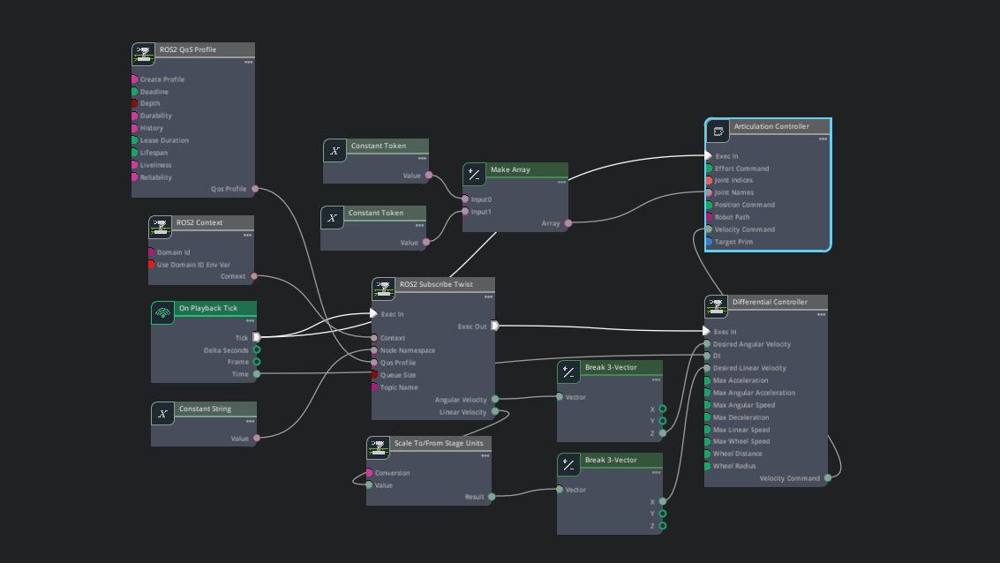
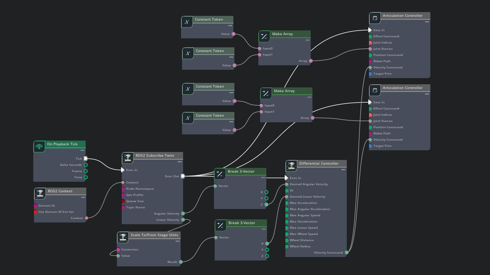
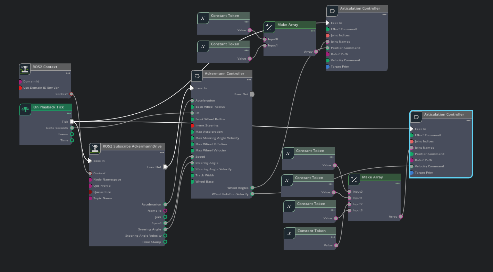
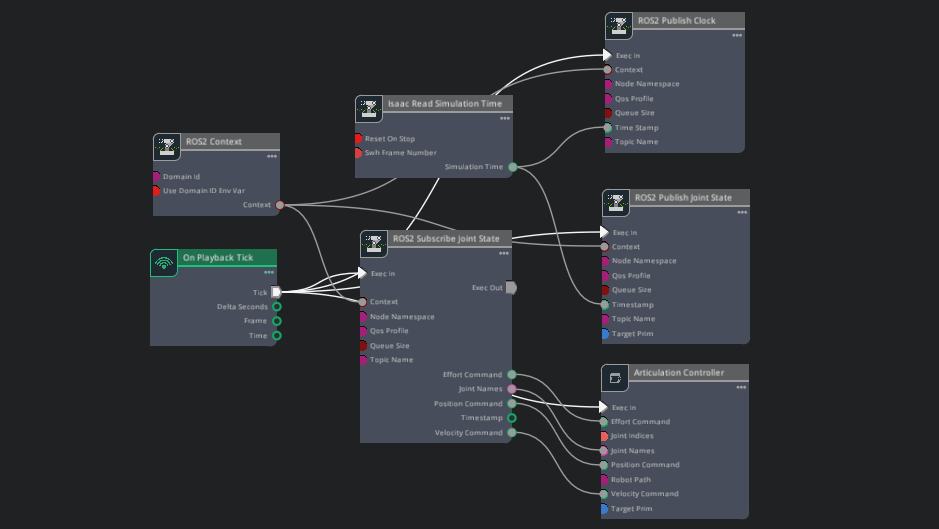
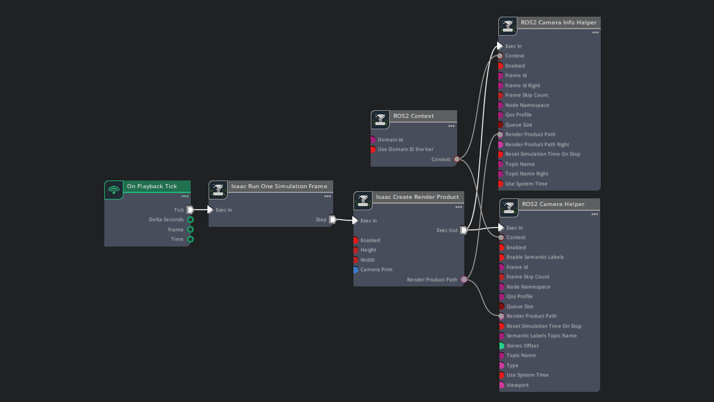
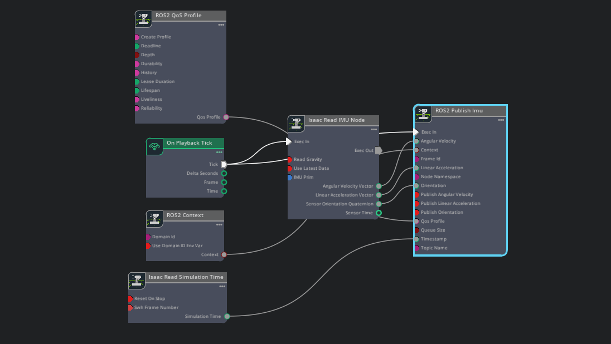
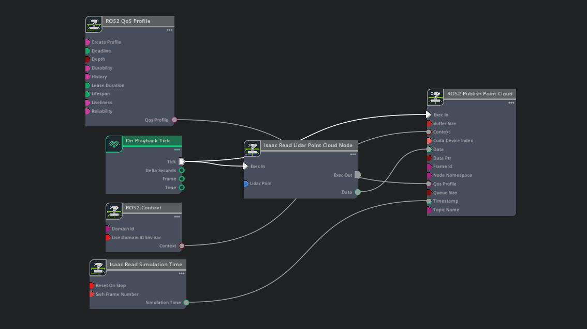
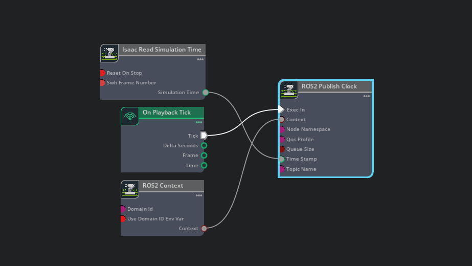

# Isaac Sim Action Graphs

This repository showcases **Action Graphs** created using [NVIDIA Isaac Sim](https://developer.nvidia.com/isaac-sim), a robotics simulation platform built on NVIDIA Omniverse. Action Graphs are visual scripting tools used to define simulation logic, robot behaviors, and sensor data flows without writing traditional code.

## 🌟 Highlights

- Visual examples of Isaac Sim Action Graphs
- Component-specific demos (e.g. Camera, Robot Controller)
- Screenshots of graph structures for learning/reference

## 🔍 Categories

### 🔧 Controllers

#### ➤ 2 wheel Differential Drive

#### ➤ 4 wheel Differential Drive

#### ➤ 4 Ackermanns Drive(Car Drive)

#### ➤ Robotic Arm - Joint State Controller and Publisher

### 📷 Sensors

#### ➤ RGB Camera 

#### ➤ IMU 

#### ➤ 3D Lidar (pointcloud) 

### 🔧 ROS2

#### ➤ ROS2 Clock

